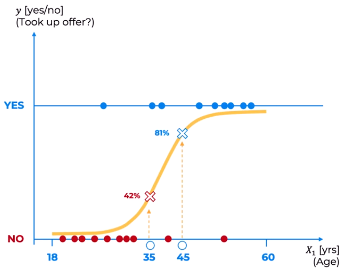
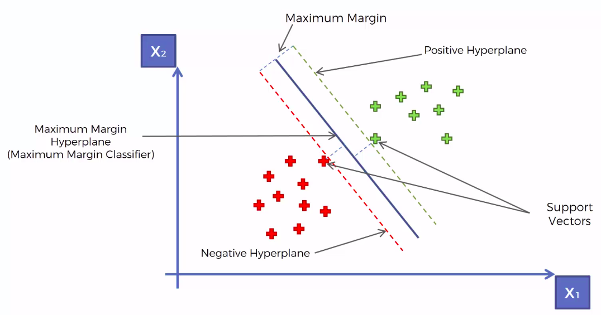

## Logistic regression

Predict a categorical dependendent variable from a number of indepedent variables.

`ln( p / 1-p ) = b_0 + b_1 * X_1`

**Intuition**

Predict (yes / no) if a person will purchase health insurance.

Notice that the curve is a sigmoide function.

We can set a threshold for probabilities in order to decide a category.

The likelihood of a curve is simply multiply the outcome probabilities of some set of data points, then, we will be selecting the best S-curve to be that with the **Maximum Likelikhood**.

## K-nearest neighbors

**Algorithm**

1. Choose the number K of neighbors.
2. Take the K nearest neighbors of the new data point, according to the Euclidian distance.
3. Among these K neighbors, count the number of data points in each category.
4. Assign the new data point to the category where you counted the most neighbors.

## Support Vector Machine - SVM

