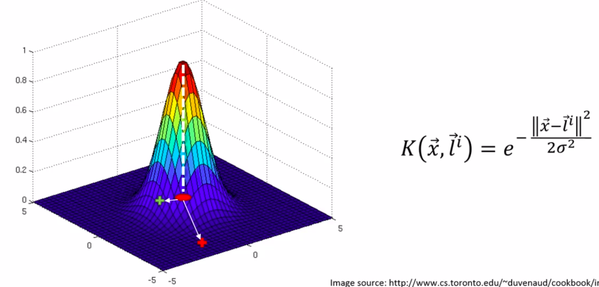
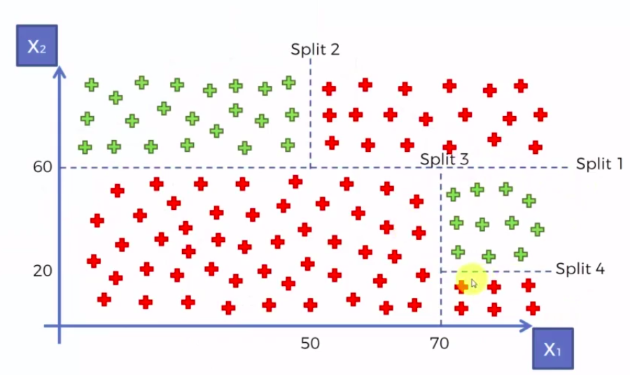

## Logistic regression

Predict a categorical dependendent variable from a number of indepedent variables.

`ln( p / 1-p ) = b_0 + b_1 * X_1`

**Intuition**

Predict (yes / no) if a person will purchase health insurance.

Notice that the curve is a sigmoide function.

We can set a threshold for probabilities in order to decide a category.

The likelihood of a curve is simply multiply the outcome probabilities of some set of data points, then, we will be selecting the best S-curve to be that with the **Maximum Likelikhood**.

## K-nearest neighbors

**Algorithm**

1. Choose the number K of neighbors.
2. Take the K nearest neighbors of the new data point, according to the Euclidian distance.
3. Among these K neighbors, count the number of data points in each category.
4. Assign the new data point to the category where you counted the most neighbors.

## Support Vector Machine - SVM

## Kernel SVM

It's possible to mapping a no-linear separable dataset to a higher dimensions and be linear sepearable.

**Original dataset looks like**

**Then**

Mapping to a higher dimensional space can be highly compute-intensive. So the kernel trick is the solution.

**The Gaussian RBF (Radious Basic Function) Kernel**

You can look that it's intuitive understant the plot and the equation.
**X** vector are the data points and the `l_i` vector stands for "landmark" located at the center of the plot. So, when the difference between X and L is 0, `e^0` the output is 1 (as you can see). 
Sigma define the radious of the base circle of the plot...

Why does landmark is located at the "center"? In reality, we can think in more complex scenarios, where we have a data classes as islands, so when using two kernels (with their respective landmarks) we can figure out the linear separation.

**Another types of kernel functions, commonly used**
- Sigmoid Kernel
- Polynomial Kernel

## Bayes Theorem

P(A | B) = (P(B | A) * P(A)) / P(B)

### Naive Bayes

- Naive because it makes the assumption that the features are independent, in some cases isn't true.

## Decision Tree

The algorithm basically works making enough splits, in order to reduce entropy each time one happens.

The leaves define the class to be given to the dataset.

That's the old method, it was reborn with upgrades...random forest, grandient boosting, ...

## Random Forest

Ensemble learning is like a team of ML algos to create a bigger one.

A random forest is a ensemble learning method using decision trees.

**Algorithm overview**

1) Pick at random K data points from the Training set.

2) Build the Decision Tree associated to these K data points.

3) Choose the number Ntree of trees you want to build and repeat STEPS 1 & 2.

4) For a new data points, make each one of your Ntre trees to predict the category to which the data points belongs, and assign the new data point to the category that wins the majority vote.

## Cumulative Accuracy Profile - CAP Curve

A more robust way to measure effectiveness of a model than the accuracy.

The basic idea is to think that the wider the area betwen the top curve and the linear curve, the better the model.

CAP != ROC (Receiver Operating Characteristic).

How to analyze the CAP?

This is a simple rule that you can follow to know how good is the model given its CAP.

# Pros and cons of the models

The assumptions of the logistic regression model are:
- Linearity in the logit for continuous variables.
- Absence of multicollinearity.
- Lack of strongly influential outliers.

