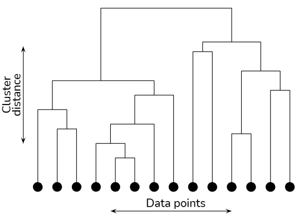
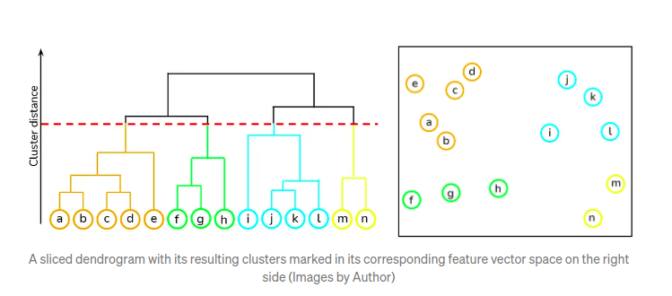

## K-Means clustering

Clustering: Group unlabeled data.

The basic step by step process is:
1. Choose K centroids and locate them in wherever on the hyperplane.
2. Assign any label to each centroid
3. Calculate the euclidean distance to every point to assign the label regards the shortest distance to the centroid.
4. Get average by each axe and then re-locate the centroid.
5. Go to 3) step enough times.

**How many centroids to select? or what K is the best?**

- The first approach depends on the domain of the data problem.

If that information isn't available then you can use the Elbow Method:

>> The elbow method runs k-means clustering on the dataset for a range of values for k (say from 1-10) and then for each value of k computes an average score for all clusters. By default, the distortion score is computed, the sum of square distances from each point to its assigned center.

https://www.scikit-yb.org/

**K-means++**

There is a problem called the random initialization trap, sometimes when using the same K you can get two different results.

To have a 'deterministic algorithm' we can define a initialization algo.

1) Choose first centroid at random among data points.
2) For each of the remaining data points compute the distance (D) to the nearest out of already selected centroids.
3) Choose next centroid among remaining data points using weighted random selected selection - weighted by `D²`.
4) Repeat steps 2 and 3 until all k centroids have been selected.
5) Proceed with standard k-means clustering algo.

In reality, this algo only decreases the probability of the random initialization trap to happens.

## Hierarchical Clustering

Same as K-means but different process. There are two approaches: agglomerative and divisive (which is actually a kinda reverse process of the former).

**Agglomerative HC**
1) Make each data point a single-point cluster -> that forms N clusters.
2) Take the two closest data points and make them one cluster -> that forms N-1 clusters.
3) Take the two closest clusters and make them one cluster -> that forms N-2 clusters.
4) Repeat step 3 until there is only one cluster.
5) The end.

Note: In this process we will be saving a dendogram.

Distances between two clusters (you can choose any of them):

- Option 1: Closest points.
- Option 2: Furthest points.
- Option 3: Average distance.
- Option 4: Distance between centroids.

**What is a dendogram?**

It's like the memory of each single step of the algorithm. Basically registers the di-simililarity (euclidian distance) bewteen two clusters (or data points) when they are about to be collapsed into one single cluster.

Then we set a threshold for the di-simililarity choosen by graphically inspection, and every "collapse" with di-simililarity above the threshold can be indicathe the number of clusters to consider (but thinking graphically, in reality is only the number of vertical lines crossed by the threshold which will be a horizontal line and the collapses - bar plots).

**What is the optimal # of clusters?**

Given all the vertical lines, the approach is the select the largest one, because the threshold line is probable doesn't cross the horizontal lines of the bar plots representing the collapses between clusters. Check the notebook to understand better this point.

_Images by Prasad Pai_