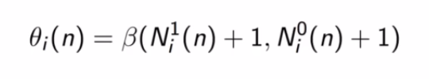

## The Multi-armed Bandit Problem

The problem to tackle in this section of reinforcement learning will be the multi-armed bandit problem which consist in figure out the distributions of outputs of several machine, which have an "arm" to be operated. This in order to maximize the profit (or something like that). While using a machine you are spending money.

For example you can find that the third machine has the best distribution, because its output are skewed to the left which means higher outcomes.

We can think in a practical use, when showing ads to customers, we want to maximize the Click Through Rate, and hopelly increase the sales.

## Upper Confidence Bound (algorithm) Intuition (UCB)

Example:
- We have d arms. For example, arms are ads that we display to users each time they connect to a web page.
- Each time a user connects to this web page, that makes a round.
- At each round n, we choose one ad to display to the user.
- At each round n, ad i gives reward r_i(n) E {0, 1}; r_i(n) = 1 if the user clicked on the ad i, 0 if the user didn't.
- Our goal is to maximize the total reward we get over many rounds.

**Algorithm - deterministic algorithm**

Step 1: At each round n, we consider two numbers for each ad i:

    - N_i(n) - the number of times the ad i was selected up to round n.
    - R_i(n) - the sum of rewards of the ad i up to round n.

Step 2: From these 2 numbers, we compute:

Step 3: We select the ad i that has the maximum UCB = r_i(n) + delta_i(n).

## Thomson Sampling

Use case - Advertising

- We have `d` arms. For example, arms are ads that we display to users each time they connect to a web page.
- Each time a user connects to this web page, that makes a round.
- At each round `n`, we choose one ad to display to the user.
- At each round `n`, ad `i` gives reward `r_i(n) E {0,1}:  r_i(n)=1` if the user clicked on the ad `i`, 0 if the user didn't.
- Our goal is to maximize the total reward we get over many rounds.  

**Algorithm - probabilistic algorithm**

The intution behind this algo. is that we are constructing distributions of where we think the actual expected value may lie.

Different to the UCB algo, in this algo. you don't need to update the values at every round, so it can accommodate delayed feedback.
 
Step 1: At each round n, we consider two numbers for each ad i:

    - N1_i(n) - the number of times the ad i got rewarded 1 up to round n.
    - N0_i(n) - the number of times the ad i got rewarded 0 up to round n.

Step 2: For each ad i, we take a random draw from the probability distribution below:

Step 3: We select the ad that has the highest θ_i(n).

