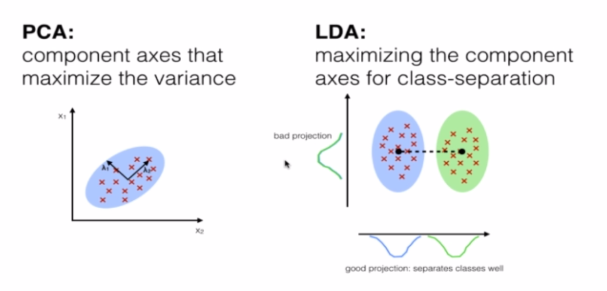

# Dimensionality Reduction

## Principal Component Analysis (PCA)

**Applications**
- Noise filtering
- Visualization
- Feature extraction
- Stock market predictions
- Gene data analysis

**Objective**

Reduce the dimensions of a d-dimensional dataset by projecting it onto a (k)-dimentional subspace (where k<d).

**Algo**

1) Standardize the data.
2) Obtain the Eigenvectors and Eigenvalues from the covariance matrix or correlation matrix, or perform Singular Vector Decomposition.
3) Sort eigenvalues in descending order and choose the k eigenvectors that correspond to the k-largest eigenvalues where k is the number of dimensions of the new feature subspace (k <= d).
4) Construct the projection matrix W from the selected k eigenvectors.
5) Transform the original dataset X via W to obtain a k-dimensional feature subspace Y.

## Linear Discriminant Analysis (LDA)

- Used as a dimensionality reduction technique.
- Used in the pre-processing step for pattern classification.

Similar to PCA...but.

LDA differs because in addition to finding the component axis with LDA we are interested in the axes that maximize the separation between multiple classes.

PCA is described as unsupervised but LDA is supervised because of the relation to the dependant variable.

**Algo**
1) Compute the d-dimensional mean vectors for the different classes from the dataset.
2) Compute the scatter matrices (in between-class and within-class scatter matrix).
3) Compute the eigenvectors (e1, e2, ... , ed) and corresponding eigenvalues (lambda1, lambda2, ..., lambda_n) for the scatter matrices.
4) Sort the eigenvectors by decreasing eigenvalues and choose k eigenvectors with the largest eigenvalues to form a d*k dimensional matrix W (where every column represents an eigenvector).
5) Use this d*k eigenvector matrix to transform the samples onto the new subspace. This can be summarized by the matrix multiplication: Y = X * W (where X is and n*d-dimensional matrix representing the n samples, and y are the transformed n*k-dimensional samples in the new subspace).